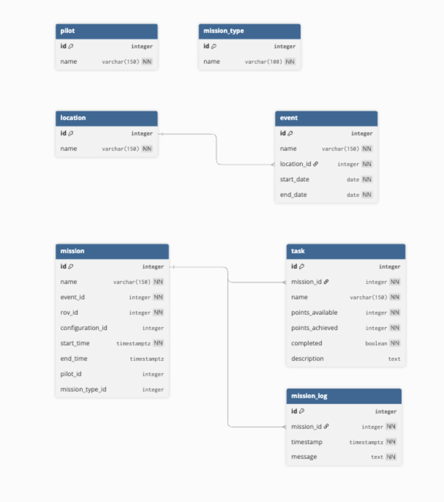
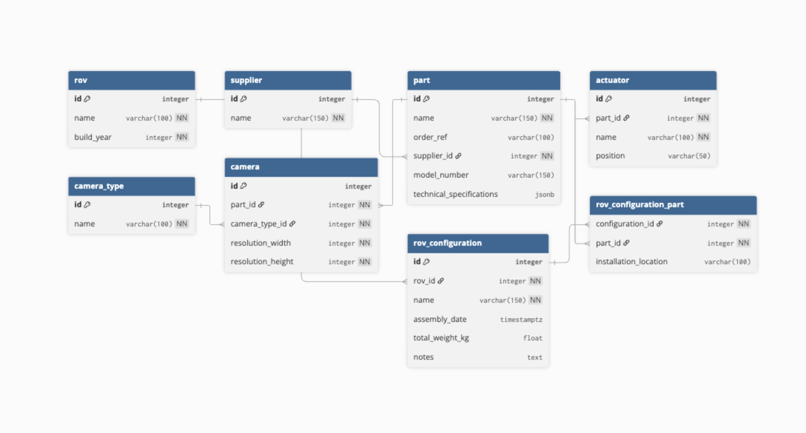
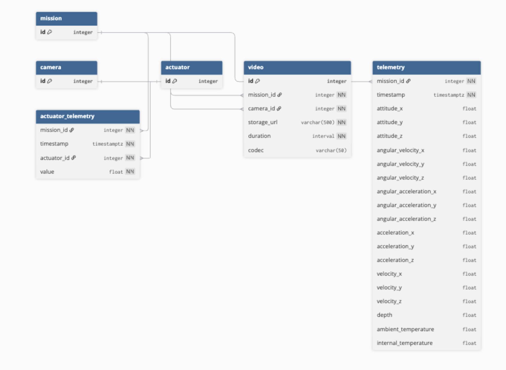

# Database Technology Selection

The system should stores two categories of data:
#### 1. Relational Metadata

Examples include:
- Dive events
- Competition locations
- Vehicle configuration
- Future parts catalogue
These entities require referential integrity, relational joins, and schema enforcement.

#### 2. Telemetry Data
Telemetry consists of periodic measurements from onboard sensors, such as:
- Depth
- Orientation
- Voltage and current
- Thruster commands
- Environmental readings
Telemetry is recorded at ~20 Hz per channel during dives.

## PostgreSQL Selection
A PostgreSQL relational database was selected as the core storage engine.
PostgreSQL provides:
- Strong ACID guarantees
- Mature ecosystem and tooling
- Advanced data types (JSONB, arrays)
- Robust relational modelling
- Extensive community support
These properties make it well suited to managing both telemetry records and relational metadata.

### Why a Time-Series Database Was Not Used
Time-series databases such as TimescaleDB or InfluxDB are typically deployed when dealing with very high ingestion rates, long retention periods, or large sensor fleets.

Our expected telemetry volume is comparatively small.

Approximate worst-case dataset:
`20 telemetry channels
20 Hz sampling
20 minute dive
This yields roughly:
20 × 20 × 1200 = 480,000 measurements per dive`


Even with multiple dives per competition, the total data volume remains well within the efficient operating range of a standard PostgreSQL table.

Telemetry will therefore be stored using a column-wide relational schema, for example:
- timestamp
- depth
- roll
- pitch
- yaw
- voltage
- current
- thruster_1
- thruster_2
- ...

This approach avoids the operational complexity of introducing a specialised time-series database while maintaining simple SQL-based analysis and visualisation.

## Deployment Strategy
Cloud Database Provider: Supabase
The primary database instance will be hosted using the Supabase free tier, which provides:
- Managed PostgreSQL hosting
- Automatic backups
- Integrated API tooling

Using a managed database significantly reduces the operational burden on the team compared with self-hosting infrastructure.

### Rationale
A cloud-hosted database provides several practical advantages:
- Centralised team access
- Simplified infrastructure management
- Supabase manages database maintenance, patching, and backups, eliminating the need for manual database administration.
- Persistent storage across competitions
- Historical telemetry and dive metadata remain continuously available for analysis, testing, and machine learning experiments.

### Network Assumptions
Competitions typically provide local WiFi access, allowing the top-side base station laptop to communicate with the cloud database during operation.

Telemetry will therefore be transmitted from the ROV software stack to the topside system and then forwarded to the cloud database for storage.

Because telemetry ingestion is performed asynchronously, database operations never block the ROV control loop.

### Local Fallback Strategy
Although cloud connectivity is expected, the system includes a simple fallback mechanism to handle temporary network disruptions.

If internet connectivity becomes unavailable:
- A local PostgreSQL instance (Dockerised) can run on the topside laptop.
- Telemetry is written locally during the dive
- Once connectivity returns, the local database can be synchronised with the Supabase instance.

This approach preserves the advantages of a cloud-hosted database while ensuring that no telemetry data is lost if network connectivity is temporarily unavailable.

### Supabase keep alive
Supabse free tier automatically pauses after 7 days of no usage, we will need to run a cron job or similar that keeps the database active to avoid needing to constantly unpause.

### Cost Considerations

The architecture relies entirely on free or open-source components:
PostgreSQL
Supabase free tier hosting
Docker
MQTT messaging infrastructure
Standard SQL tooling

This allows the team to deploy a reliable telemetry and analytics pipeline without incurring infrastructure costs.

## Intial ER Diagram
#### Mission Operations

#### Rov Configuration

#### Telemetry

#### Complete Tables
```
Table rov {
  id integer [primary key]
  name varchar(100) [not null, unique]
  build_year integer [not null]
}

Table supplier {
  id integer [primary key]
  name varchar(150) [not null, unique]
}

Table part {
  id integer [primary key]
  name varchar(150) [not null]
  order_ref varchar(100)
  supplier_id integer [not null, ref: > supplier.id]
  model_number varchar(150)
  technical_specifications jsonb
  indexes {
    (supplier_id, name) [unique]
  }
}

Table actuator {
  id integer [primary key]
  part_id integer [not null, ref: > part.id]
  name varchar(100) [not null]
  position varchar(50)

  indexes {
    part_id
    (part_id, name) [unique]
  }
}

Table location {
  id integer [primary key]
  name varchar(150) [not null]
}

Table event {
  id integer [primary key]
  name varchar(150) [not null]
  location_id integer [not null, ref: > location.id]
  start_date date [not null]
  end_date date [not null]
  indexes {
    (location_id, name) [unique]
  }
}

Table mission {
  id integer [primary key]
  name varchar(150) [not null]
  event_id integer [not null, ref: > event.id]
  rov_id integer [not null, ref: > rov.id]
  configuration_id integer [ref: > rov_configuration.id]
  start_time timestamptz [not null]
  end_time timestamptz
  pilot_id integer [ref: > pilot.id]
  mission_type_id integer [ref: > mission_type.id]

  indexes {
    (event_id, name) [unique]
    rov_id
    configuration_id
    pilot_id
    mission_type_id
  }
}

Table task {
  id integer [primary key]
  mission_id integer [not null, ref: > mission.id]
  name varchar(150) [not null]
  points_available integer [not null, default: 0]
  points_achieved integer [not null, default: 0]
  completed boolean [not null, default: false]
  description text
  indexes {
    (mission_id, name) [unique]
    mission_id
  }
}

Table camera_type {
  id integer [primary key]
  name varchar(100) [not null, unique]
}

Table camera {
  id integer [primary key]
  part_id integer [not null, ref: > part.id]
  camera_type_id integer [not null, ref: > camera_type.id]
  resolution_width integer [not null]
  resolution_height integer [not null]
  indexes {
    part_id
    camera_type_id
  }
}

Table video {
  id integer [primary key]
  mission_id integer [not null, ref: > mission.id]
  camera_id integer [not null, ref: > camera.id]
  storage_url varchar(500) [not null]
  duration interval [not null]
  codec varchar(50)

  indexes {
    mission_id
    camera_id
    (mission_id, camera_id, storage_url) [unique]
  }
}

Table rov_configuration {
  id integer [primary key]
  rov_id integer [not null, ref: > rov.id]
  name varchar(150) [not null]
  assembly_date timestamptz
  total_weight_kg float
  notes text
  indexes {
    rov_id
    (rov_id, name) [unique]
  }
}

Table rov_configuration_part {
  configuration_id integer [not null, ref: > rov_configuration.id]
  part_id integer [not null, ref: > part.id]
  installation_location varchar(100)

  indexes {
    part_id
    (configuration_id, part_id) [pk]
  }
}

Table pilot {
  id integer [primary key]
  name varchar(150) [not null, unique]
}

Table mission_type {
  id integer [primary key]
  name varchar(100) [not null, unique]
}

Table mission_log {
  id integer [primary key]
  mission_id integer [not null, ref: > mission.id]
  timestamp timestamptz [not null]
  message text [not null]
  indexes {
    mission_id
  }
}

Table telemetry {
  mission_id integer [not null, ref: > mission.id]
  timestamp timestamptz [not null]

  attitude_x float
  attitude_y float
  attitude_z float

  angular_velocity_x float
  angular_velocity_y float
  angular_velocity_z float

  angular_acceleration_x float
  angular_acceleration_y float
  angular_acceleration_z float

  acceleration_x float
  acceleration_y float
  acceleration_z float

  velocity_x float
  velocity_y float
  velocity_z float

  depth float
  ambient_temperature float
  internal_temperature float

  indexes {
    (mission_id, timestamp) [pk]
  }
}

Table actuator_telemetry {
  mission_id integer [not null, ref: > mission.id]
  timestamp timestamptz [not null]
  actuator_id integer [not null, ref: > actuator.id]
  value float [not null]

  indexes {
    (mission_id, timestamp, actuator_id) [pk]
    (actuator_id, mission_id, timestamp)
  }
}
```